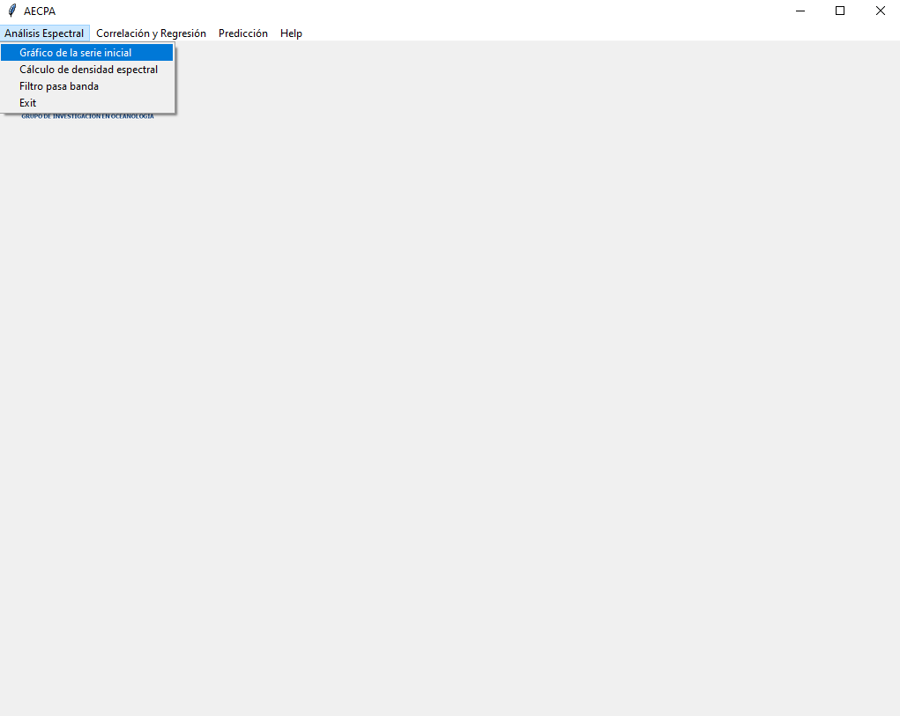

# AECPA 
## Análisis Espectral; Correlación Cruzada; Predición ARIMA.

Vista del menú principal del programa AECPA:

  </img>

### Análisis Espectral - Gráfico de la serie inicial:

  </img>

Se abre el explorador de Windows, donde se puede seleccionar el archivo con los datos iniciales:

  </img>

Al seleccionar el archivo, hay que escribir el nombre de la hoja de Excel donde se encuentran los datos, también el número de la columna de fechas y número de la columna de la serie investigada, después oprimir el botón de “Continuar”: 

  </img>

En el siguiente paso se puede escribir los nombres de títulos de la figura y de los ejes, después oprimir el botón de “Continuar”:

  </img>

Se abre el explorador de Windows, donde se puede escribir el nombre de la figura para grabar:

  </img>

Al grabar la figura, también se visualiza en la pantalla:

  </img>

### Análisis Espectral - Cálculo de densidad espectral:

  </img>

Al oprimir se abre el explorador de Windows, para seleccionar el archivo de datos para realizar el cálculo de la densidad espectral:

  </img>

Se escribe el nombre de la hoja de Excel donde se encuentran los datos, también el núero de la columna de fechas y número de la columna de la serie investigada, después oprimir el botón de “Continuar”: 

  </img>

En el siguiente paso se escribe los nombres de título de la figura y de los ejes:

  </img>

Al oprimir el botón “Continuar” aparece el gráfico de la densidad espectral de la serie:

  </img>

En este grafico se muestran las densidades espectrales de la serie analizada.
Apuntando con el cursor en la parte inferior derecha de la gráfica aparecen las coordenadas del cursor en la gráfica, por ejemplo “x=0.0347 y=10.1”, donde “x” muestra la frecuencia del límite apuntado. Así se pueden obtener los valores de cada frecuencia límite (inferior o superior) del pico seleccionado, los cual se pueden escribir en una hoja para los siguientes procedimientos:

  </img>

### Análisis Espectral - Filtro pasa banda:

  </img>

Al oprimir se abre el explorador de Windows, en el cual se selecciona el archivo de datos para realizar el filtro pasa banda:

  </img>

Se escribe el nombre de la hoja de Excel donde se encuentran los datos, también el número de la columna de fechas y número de la columna de la serie analizada, después oprimir el botón de “Continuar”: 

  </img>

En el siguiente paso hay que llenar todas de las casillas para extraer los componentes determinados de la serie inicial.
En la casilla cuasi periodos: se escriben todos los periodos de los picos elegidos, separados por coma ",".
En la casilla FLI: se escriben todos las frecuencias izquierdas en el mismo orden de los picos elegidos, separados por coma ",".
En la casilla FLS: se escriben todos las frecuencias derechas en el mismo orden de los picos elegidos, separados por coma ",".
Al oprimir el boton "Continuar" se graban los componentes extraídos en el archivo Excel y se mostra la grafica con los componentes extraídas:  

  </img>

  </img>

### Exit
Cierra el programa:

  </img>

### Correlación y Regresión - Correlación de Pearson:

  </img>

Al oprimir se abre el explorador de Windows, para seleccionar el archivo de datos para realizar la Correlación de Pearson:

  </img>

Después de elegir el archivo, se escriben los nombres de las hojas de la primera y segunda serie y sus respectivas numeros de las columnas donde se encuentran:

  </img>

Se muestran los resultados del coeficiente de correlación:

  </img>

### Correlación y Regresión - Correlación cruzada:

  </img>

Al oprimir se abre el explorador de Windows, se selecciona el archivo de datos para realizar Correlación cruzada:

  </img>

Después de elegir el archivo, se escriben los nombres de las hojas de la primera y segunda serie y sus respectivos numeros de las columnas donde se encuentran y el número de la columna con las fechas:

  </img>

Resultados de la Correlación cruzada:

  </img>

### Correlación y Regresión - Análisis de regresión:

  </img>

Al oprimir se abre el explorador de Windows, se selecciona el archivo de datos para realizar el Análisis de regresión:

  </img>

Después de elegir el archivo, se escriben los nombres de la hoja de datos, el número de la columna con las fechas, el número de la columna de la variable dependiente y la cantidad de variables independientes:

  </img>

Por cada variable independiente se escribe su respectivo número de la columna y se oprime "Continuar":

  </img>

  </img>

Continuar:

  </img>

Resultados del análisis de regresión:

  </img>

Resultado análisis de regresión gráfica:

  </img>

### Exit
Cierra el programa:

  </img>

### Predicción - Análisis parámetros_ARIMA:

  </img>

Al oprimir se abre el explorador de Windows, se selecciona el archivo de datos para realizar Análisis de parámetros ARIMA:

  </img>

Escribir el nombre de la hoja del Excel de la variable que se va utilizar, la fecha en que se inicia la serie, el nombre de la columna de la serie y varios [parámetros del modelo ARIMA](https://alkaline-ml.com/pmdarima/modules/generated/pmdarima.arima.auto_arima.html ):

  </img>

Después del cálculo de los parámetros del modelo ARIMA, se muestran los resultados de los cuales se escriben en una hoja los resultados del modelo, por ejemplo "SARIMAX(2, 0, 3)x(2, 1, 0, 12)":

  </img>

### Predicción - Resultados Test ARIMA:

  </img>

Al oprimir se abre el explorador de Windows, se selecciona el archivo de datos para ver los resultados del Test ARIMA con los mismos datos con los cuales fue realizado el cálculo de los parámetros del modelo ARIMA:

  </img>

Se elige la serie de datos para el cual fueron calculados los parámetros del modelo ARIMA y los resultados del modelo SARIMAX:

  </img>

Se muestran los resultados de SARIMAX:

  </img>

Resultados gráficos de SARIMAX:

  </img>

### Predicción - Mostrar Pronostico:

  </img>

Se escribe la cantidad de meses para la predicción y los nombres del título de la figura y de los ejes:

  </img>

El resultado gráfico del pronóstico de la serie inicial para los 36 meses:

  </img>

### Predicción - Graficar todo:

  </img>

Al oprimir se abre el explorador de Windows, se selecciona el archivo de datos para mostrar el gráfico con la serie inicial, sus componentes y el pronóstico:

  </img>

Elegir los datos para el gráfico con varios componentes:

  </img>

Escribir el nombre de grafico para grabar:

  </img>

  </img>

### Predicción - Graficar una serie:

  </img>

Al oprimir se abre el explorador de Windows, para seleccionar el archivo de datos:

  </img>

Escribir datos para el gráfico:

  </img>

  </img>

  </img>

### Predicción - Exit:

  </img>

  </img>

### Help – Ayuda:

Abre la presente página de GitHub:

  </img>

### Help – Acerca de:

  </img>

